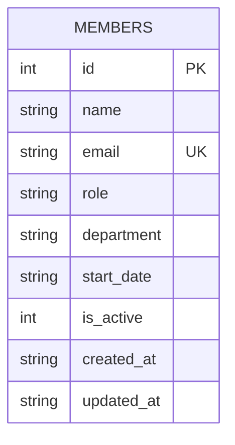

Single-table schema, defined inline in `server/src/db.ts:19-29` (no migrations directory — schema changes mean editing this `CREATE TABLE IF NOT EXISTS` statement directly, which only affects fresh databases since it won't `ALTER` an existing `data/team.db`).

## Gotchas

- `is_active` exists and `GET /api/members` filters on it (`members.ts:21`), but `DELETE /api/members/:id` (`members.ts:106-117`) does a hard `DELETE FROM members`, not a soft delete (`UPDATE ... SET is_active = 0`). Nothing in the codebase ever sets `is_active` to `0` — it only ever holds its default value of `1`. Anyone relying on `is_active` to mean "soft-deleted" will be surprised: it currently just means "seeded/inserted, i.e. always 1."
- `email` is `UNIQUE` (`db.ts:22`); `POST /api/members` (`members.ts:26-46`) catches the resulting SQLite constraint error by string-matching `err.message.includes('UNIQUE')` and returns 409 — there's no upfront existence check, so any other `UNIQUE` violation added later to this table would also surface as "member with this email already exists," which would be misleading.
- `PATCH /api/members/:id` (`members.ts:83-104`) does not accept or update `start_date` or `is_active`, only `name`, `email`, `role`, `department` — this is a narrower field set than `POST` accepts.
