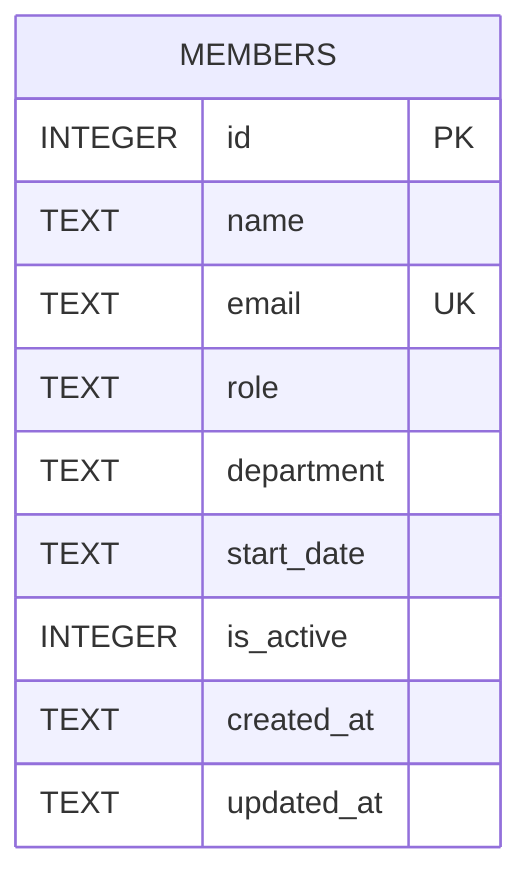

Single-table schema, created inline in `getDb()` (no migration framework — schema changes mean editing the `CREATE TABLE IF NOT EXISTS` in `server/src/db.ts` directly, which only takes effect on a fresh DB file since it's `IF NOT EXISTS`).

- `email` has a `UNIQUE` constraint; `POST /api/members` relies on catching the SQLite unique-violation error message (substring match on `'UNIQUE'`) to return `409` (`server/src/routes/members.ts:39-44`) rather than a pre-check query.
- `department` and `start_date` are free-text `TEXT`, no enum/check constraint at the DB level — see `[[gotchas]]` for the seed-data inconsistency this causes.
- `is_active` defaults to `1` and is the only active/inactive marker, but see `[[gotchas]]` — nothing in the codebase ever sets it to `0`.
