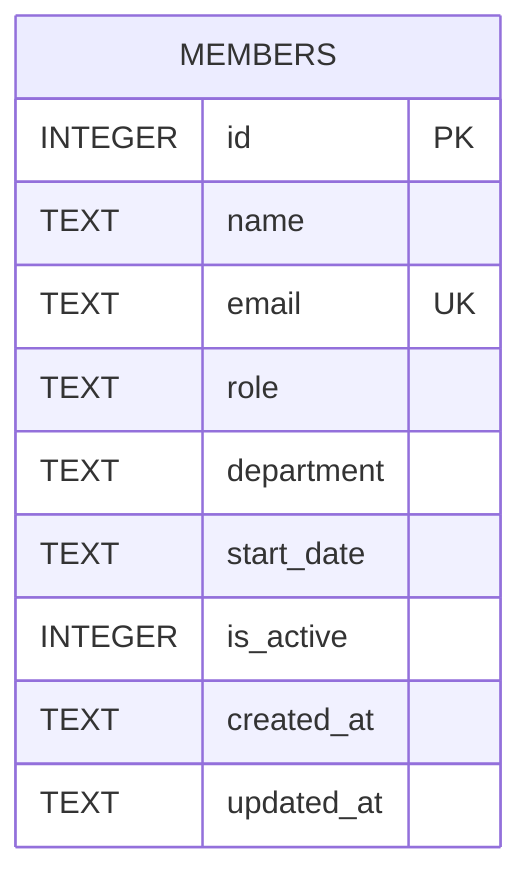

Single-table schema, defined inline in `getDb()` — no migration files, no ORM.

- `email` has a `UNIQUE` constraint; `POST /api/members` catches the
  resulting SQLite error by string-matching `err.message.includes('UNIQUE')`
  and turns it into a 409 (`server/src/routes/members.ts:40`) — there's no
  structured SQLite error code check, so any other constraint violation
  would fall through as an unhandled 500.
- `department` is a free-text column with **no validation or enum** anywhere
  in the stack (client form, `POST`, or `PATCH`) — see [[gotchas]] for why
  the seed data itself already has inconsistent department names.
- `is_active` is an integer flag (soft delete), but `DELETE
  /api/members/:id` (`server/src/routes/members.ts:115`) does a hard
  `DELETE FROM members`, not a soft-delete update — the flag is written by
  nothing except the column default (`1`).
