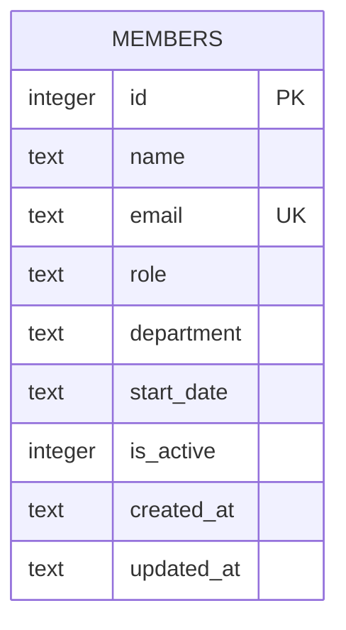

The schema lives as inline DDL in `server/src/db.ts` (`CREATE TABLE IF NOT EXISTS members ...`) — there is no separate migrations directory or ORM model file.

- `email` has a `UNIQUE` constraint; `server/src/routes/members.ts` catches the resulting SQLite error message (`includes('UNIQUE')`) and turns it into a 409 — there's no pre-check query.
- `department` is a free-text column with **no enum/check constraint or app-level validation** on insert or update. The seed data itself is inconsistent: two rows use `"Eng"` (David Kim, Hiro Tanaka) while the rest use the full `"Engineering"` — so `/api/members/stats` currently reports `Eng` and `Engineering` as separate departments. See [[gotchas]] for why this matters for any validation work.
- `is_active` is an `INTEGER` flag (soft-delete style), but `DELETE /api/members/:id` in `members.ts` does a real `DELETE FROM members`, not a soft-delete update — `is_active` is set on insert (default `1`) and never toggled anywhere in the current code.
