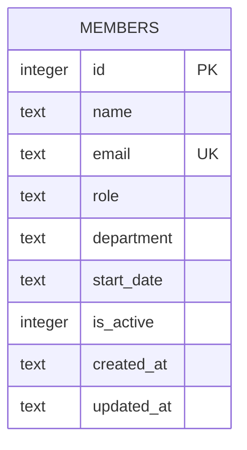

Single-table schema, created inline in `server/src/db.ts:18-30` (no migration files, no ORM — plain `db.exec(CREATE TABLE IF NOT EXISTS ...)`). Notes:

- `email` has a `UNIQUE` constraint; `server/src/routes/members.ts:39-43` catches the resulting SQLite error by matching `err.message.includes('UNIQUE')` and returns 409 — there's no pre-check query, so any other UNIQUE-violation-shaped error text would also produce a false 409.
- `department` is a plain `TEXT` column with **no CHECK constraint, enum, or lookup table** — the API accepts any string (see [[gotchas]] for the TM-105 validation gap this creates).
- `is_active` defaults to `1` and is read by `GET /api/members` (filters `WHERE is_active = 1`), but nothing in `server/src/routes/members.ts` ever sets it to `0` — `DELETE /:id` (`members.ts:106-117`) hard-deletes the row instead of soft-deleting. The column exists but the soft-delete path it implies is not implemented.
