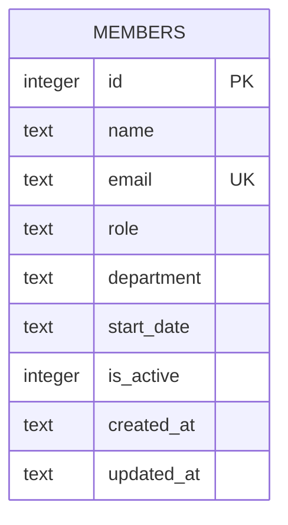

One table, defined inline in `getDb()` (`server/src/db.ts:11`) with `CREATE TABLE IF NOT EXISTS` — there is no migrations directory or schema file elsewhere.

**`is_active` is not a working soft-delete flag.** `GET /api/members` and `GET /api/members/stats` filter on `is_active = 1`, which implies members can be deactivated instead of removed — but no route ever sets `is_active` to `0`. `DELETE /api/members/:id` (`server/src/routes/members.ts:106`) does a hard `DELETE FROM members`. If a task calls for "removing" or "deactivating" a member, check which behavior is actually wanted — the current delete endpoint permanently destroys the row despite the column's presence.
