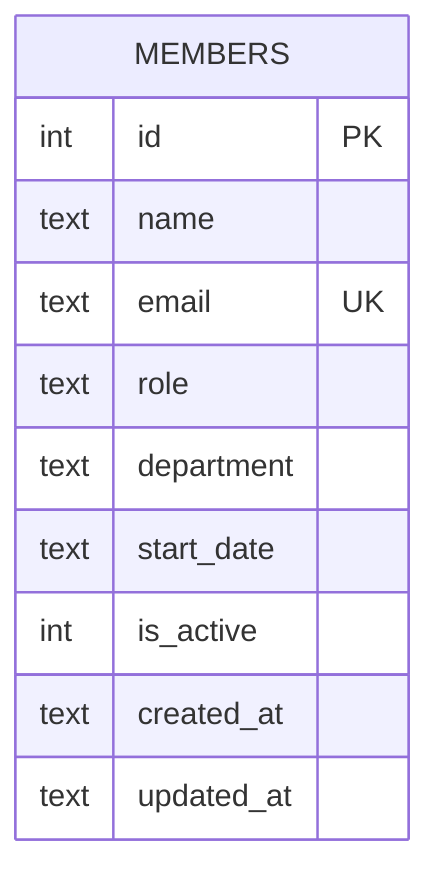

Single-table schema, created via `db.exec(CREATE TABLE IF NOT EXISTS ...)` in `getDb()` — there is no migrations directory or ORM.

- `email` has a `UNIQUE` constraint enforced at the SQLite level, not in application code. `POST /` catches the resulting error and maps it to `409` (`members.ts:39-44`); `PATCH /:id` does **not** catch this — updating a member's email to one already in use throws uncaught inside the handler (see [[gotchas]]).
- `department` has no allow-list or enum, at the DB or app level — any string is accepted on insert. Seed data uses inconsistent values for the same team (`'Engineering'` vs `'Eng'` for two different engineers in `db.ts:37-44`), which is intentional test fixture noise, not a bug to "fix" incidentally.
- `is_active` defaults to `1` on insert and is never set to `0` anywhere in the codebase — see [[gotchas]] for why this means `DELETE` is a hard delete, not a soft one.
- `start_date` is stored as free-text (whatever the client sends, e.g. `'2022-03-15'`) — there's no date type or validation.
