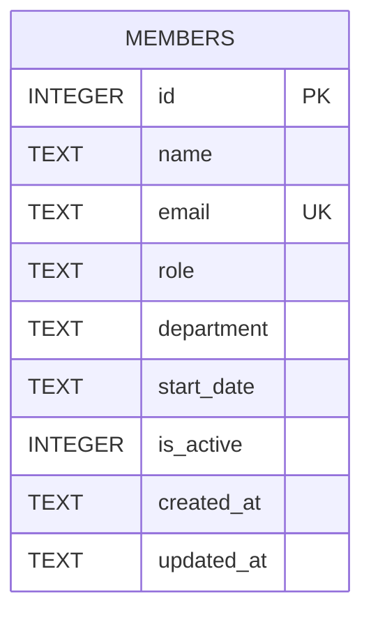

Single-table schema, created inline via `CREATE TABLE IF NOT EXISTS` in `server/src/db.ts:18-30`
(no migrations directory — the DDL in `db.ts` is the only source of truth).

- `email` has a `UNIQUE` constraint; `POST /api/members` catches the resulting SQLite error and
  maps it to `409` (`server/src/routes/members.ts:39-44`) — the only constraint-violation handling
  in the router.
- `department` and `start_date` are free-text `NOT NULL` columns with no format or allow-list
  check at the DB or route layer — see `[[overview]]` for the resulting seed-data inconsistency
  (`'Engineering'` vs `'Eng'`).
- `is_active` defaults to `1` and is read by `GET /api/members` and `GET /api/members/stats`, but
  no code path ever writes `0` to it — `DELETE` is a hard delete, not a deactivate. Don't build
  features (e.g. "restore a removed member") on the assumption that soft-delete exists.
