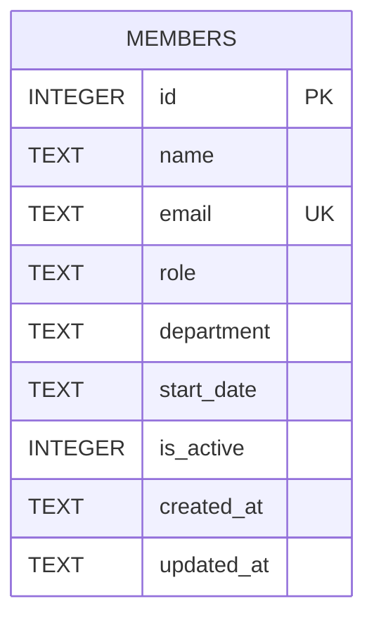

Single-table schema, defined inline as DDL in `getDb()` (`server/src/db.ts:18-30`) — no migrations directory, no ORM, no separate schema file.

- `email` is the only unique constraint; `POST /api/members` catches the resulting SQLite error by string-matching `'UNIQUE'` in the message (`server/src/routes/members.ts:40`) rather than a typed error code — fragile if the DB driver's error message format changes.
- `department` has no constraint, enum, or lookup table anywhere in the code. Seed data (`server/src/db.ts:37-44`) is itself inconsistent: Alice Chen is seeded as `'Engineering'` while David Kim and Hiro Tanaka are seeded as `'Eng'` — two spellings for the same department already exist in the "canonical" seed rows. Anyone adding department validation needs to pick/normalize a canonical list first; don't assume the seed data is the source of truth as-is. See [[gotchas]].
- `is_active` is a soft-delete flag (0/1) used by the `GET /` list query filter, but `DELETE /:id` (`server/src/routes/members.ts:106-117`) performs a hard `DELETE FROM members`, not a soft delete — the `is_active` column is written only by nothing (no route ever sets it to 0). It exists in the schema and seed inserts as a default, but no route flips it.
