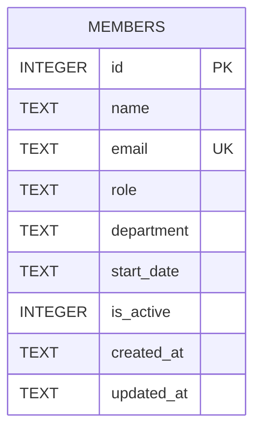

- Single table, defined inline in `getDb()` (`server/src/db.ts:19-30`) — no migrations directory, no ORM.
- `email` has a `UNIQUE` constraint; `server/src/routes/members.ts` catches the resulting SQLite error and turns it into a 409 on both the `POST` insert and the soft-delete `UPDATE` (which prefixes email with `deactivated-`).
- `department` is `TEXT NOT NULL` with no DB-level CHECK/enum, but `members.ts` enforces a `CANONICAL_DEPARTMENTS` allowlist (Engineering, Product, Design, Marketing, Sales, Operations, Finance, HR, Legal) at the application layer on `POST` and `PATCH` — validation lives in the route, not the schema. All seed rows (`server/src/db.ts:37-44`) use canonical values.
- `is_active` is an `INTEGER` (0/1) flag. `DELETE /api/members/:id` is a soft delete: it sets `is_active = 0` and prefixes `email` with `deactivated-` rather than removing the row (`members.ts:174-180`). `GET /` and `/stats` filter to `is_active = 1`; `/export` does not, so deactivated members still appear there.
