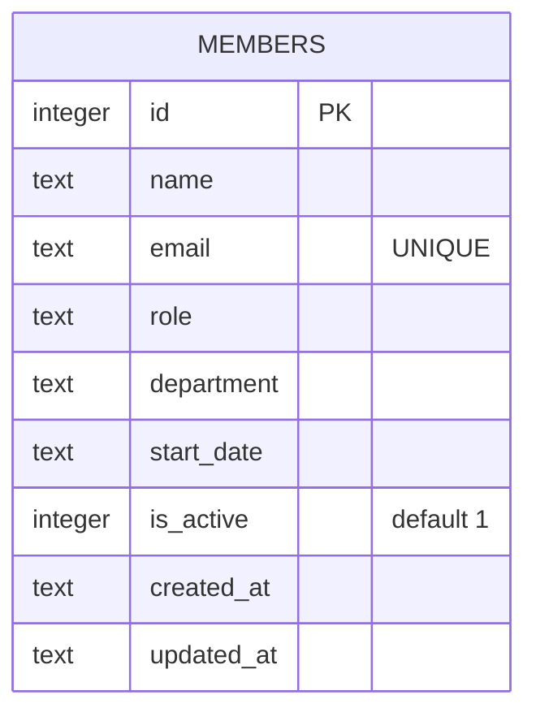

Single-table schema, defined inline as DDL in `server/src/db.ts` (`CREATE TABLE IF NOT EXISTS members ...`) — there is no separate migrations directory or schema file.

## Column write-paths (derived from `server/src/routes/members.ts`)

- `POST /api/members` — sets `name`, `email`, `role`, `department`, `start_date`. Requires all five as truthy or 400s.
- `PATCH /api/members/:id` — only updates `name`, `email`, `role`, `department` (via `COALESCE`) plus `updated_at`. **`start_date` and `is_active` are not writable through any route.**
- `DELETE /api/members/:id` — hard `DELETE FROM members`, not a soft-delete. `is_active` is never set to `0` anywhere in the codebase; it exists only as a column that's always `1` and is used purely as a read-side filter (`WHERE is_active = 1`) on `GET /api/members` and `/api/members/stats`. See [[gotchas]].
