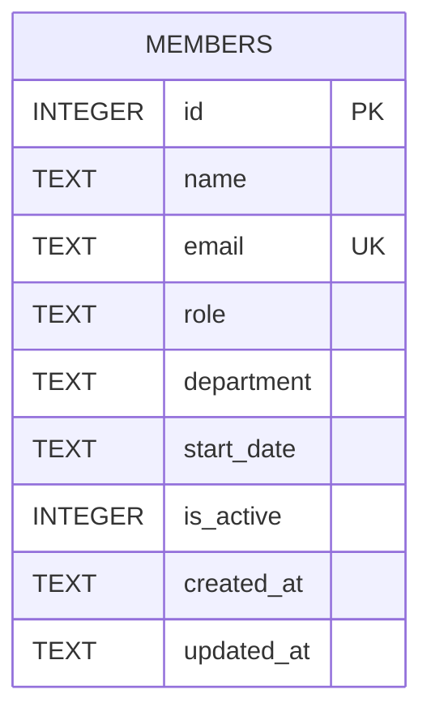

TeamBoard has one table, created inline in `getDb()` (`server/src/db.ts:18`) — there is no migrations directory or ORM.

`email` has a `UNIQUE` constraint (`server/src/db.ts:22`); `POST /api/members` catches that specific SQLite error and turns it into a `409` (`server/src/routes/members.ts:40`), but `PATCH /api/members/:id` performs the same kind of update without a matching try/catch — a PATCH that sets `email` to one already in use will throw and fall through to Express's default error handler (unhandled → 500), not a clean `409`. See [[known-issues]].

`is_active` defaults to `1` and is the filter used by `GET /api/members` and `GET /api/members/stats` (`WHERE is_active = 1`), but nothing in the codebase ever writes `is_active = 0` — `DELETE /api/members/:id` does a real `DELETE FROM members` (`server/src/routes/members.ts:115`), and `PATCH` never touches the column. The soft-delete column exists in the schema but the delete path is hard-delete only.
