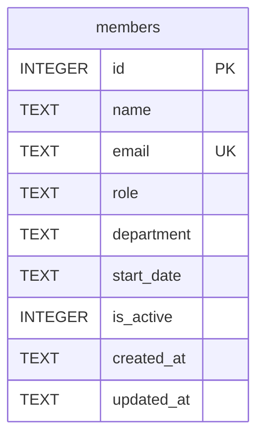

Single-table schema, created inline in `getDb()` via `CREATE TABLE IF NOT EXISTS` — there is no migration system or separate schema file.

## Non-obvious facts

- `email` has a `UNIQUE` constraint enforced at the DB level; `POST /api/members` catches the SQLite `UNIQUE` error and turns it into a 409 (`server/src/routes/members.ts`). No other route path checks uniqueness before writing.
- `department` is a free-text column — there is no enum/lookup table constraining it, and no application-level validation on insert or update (see [[gotchas]]).
- `is_active` defaults to `1` on insert and is never set to `0` anywhere in the codebase — `DELETE /api/members/:id` performs a real `DELETE FROM members`, not a soft-delete flip. The column only affects `GET /api/members` and `/stats`, which filter `WHERE is_active = 1`.
- Seed data (8 members) is inserted once, only when the table is empty (`COUNT(*) === 0` check), so it won't re-seed after any row exists.
