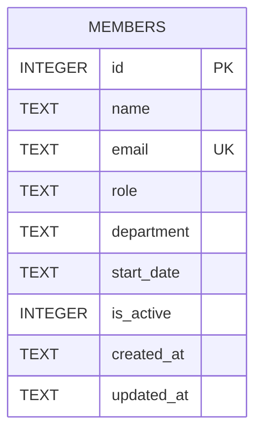

Single table, no foreign keys, no migrations framework — schema is a `CREATE
TABLE IF NOT EXISTS` inlined in `getDb()` (`db.ts:18-30`). `department` is a
free-text column with no `CHECK` constraint or enum anywhere in the schema or
route code: `POST`/`PATCH` insert or update whatever string is sent
(`members.ts:35-36`, `members.ts:92-101`).

The seed data itself is inconsistent about department naming — `'Engineering'`
(Alice) vs `'Eng'` (David, Hiro) at `db.ts:37-44` — so `/api/members/stats`
groups these as two separate departments today. Anyone adding department
validation should decide up front which spelling is canonical, since existing
seed rows use both.
