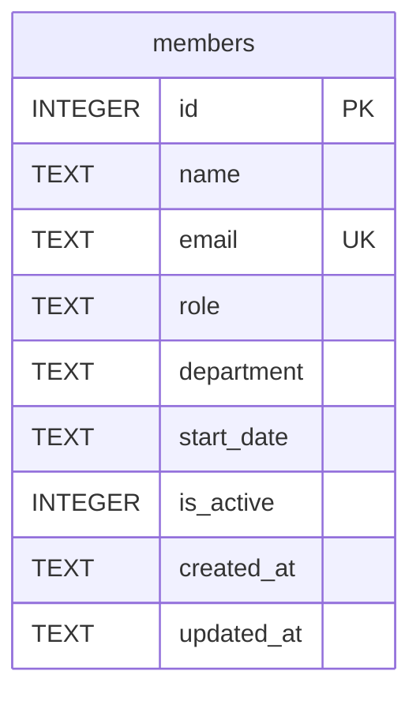

One table, created inline in `getDb()` (`server/src/db.ts:18`) — there is no
migrations directory or ORM.

- `email` has a `UNIQUE` constraint; `members.ts` POST handler catches the
  resulting SQLite error by string-matching `'UNIQUE'` in the message and
  turns it into a 409 (`server/src/routes/members.ts:40`) — there's no other
  constraint checking.
- `department` is a free-text column with **no validation or enum** anywhere
  in the DB or the API — see [[gotchas]] for why this matters right now
  (TM-105).
- Seed data (`server/src/db.ts:37-44`) itself is inconsistent: two engineers
  are seeded with `department` values `'Engineering'` and `'Eng'`
  (David Kim, Hiro Tanaka) rather than the same string. `GET /api/members/stats`
  groups by raw `department` string, so on a fresh DB the stats sidebar shows
  them as two separate departments — this is real seeded data, not a bug in
  the stats query.
- `is_active` is an `INTEGER` (0/1) flag; `DELETE /api/members/:id` does a
  hard `DELETE FROM members`, not a soft-delete via `is_active = 0`, despite
  the column existing (`server/src/routes/members.ts:115`). There is
  currently no route that ever sets `is_active` to 0.
