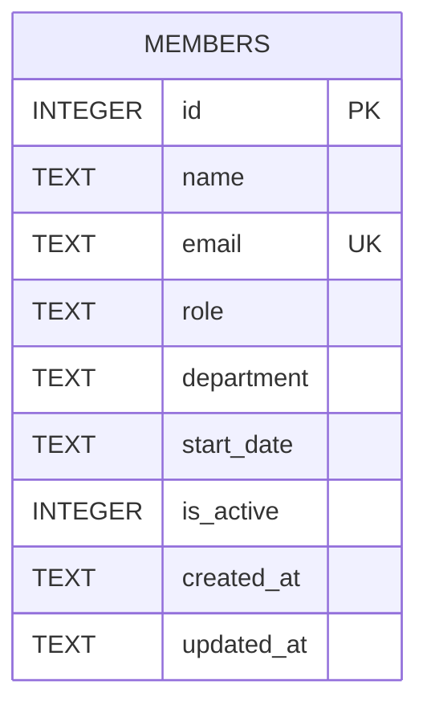

- Single table, defined inline in `getDb()` (`server/src/db.ts:19-30`) — no migrations directory, no ORM.
- `email` has a `UNIQUE` constraint; `server/src/routes/members.ts:40-43` catches the resulting SQLite error and turns it into a 409.
- `department` is a free-text column with **no enum/allowlist anywhere in the code**. The seed data itself is inconsistent: Alice Chen is seeded into `"Engineering"` while David Kim and Hiro Tanaka are seeded into `"Eng"` (`server/src/db.ts:37-44`) — two different strings for what's presumably the same department. Anything that groups or filters by department (e.g. the `/stats` endpoint) will treat these as distinct departments.
- `is_active` is an `INTEGER` (0/1) flag; `DELETE /api/members/:id` does a hard delete (`members.ts:106-117`), it does not set `is_active = 0` — there is currently no code path that ever sets `is_active` to anything other than its default of `1`.
