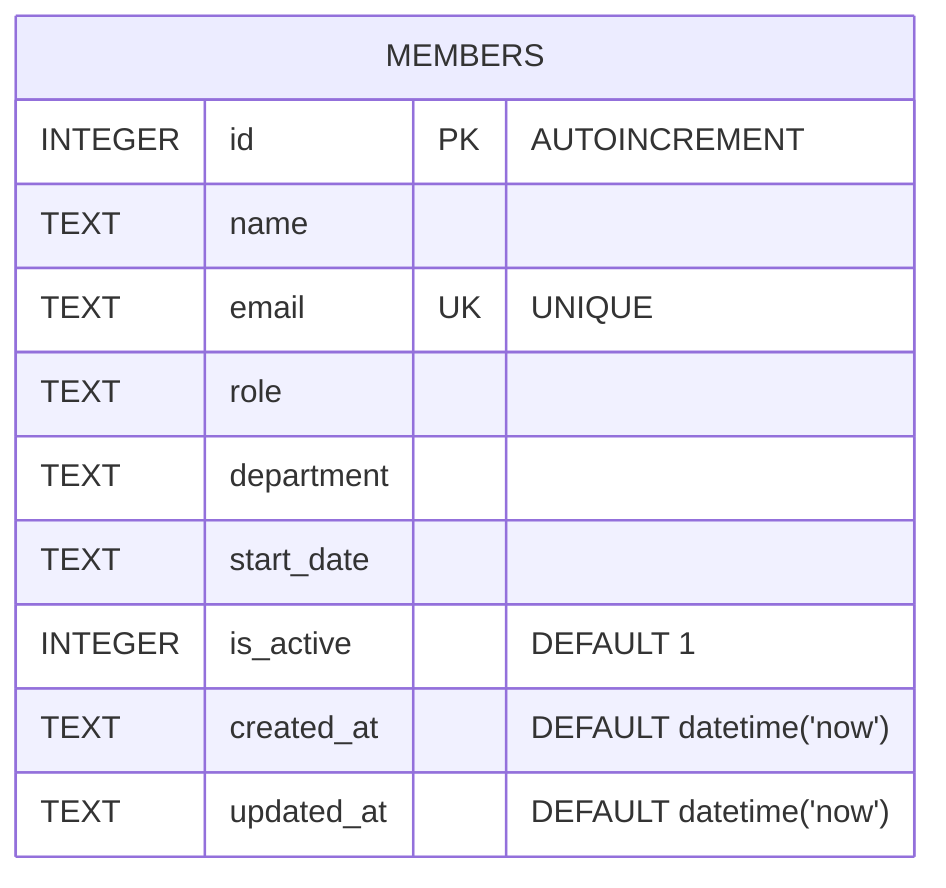

Single-table schema, created inline in `getDb()` (`server/src/db.ts:18-30`) with `CREATE TABLE IF NOT EXISTS` — there are no separate migration files. `email` has a `UNIQUE` constraint; `POST /api/members` relies on the resulting SQLite error (matched by string `'UNIQUE'`) to return 409 rather than pre-checking (`server/src/routes/members.ts:39-43`).

See [[gotchas]] for the `is_active` column behavior, which diverges from what its presence implies.
