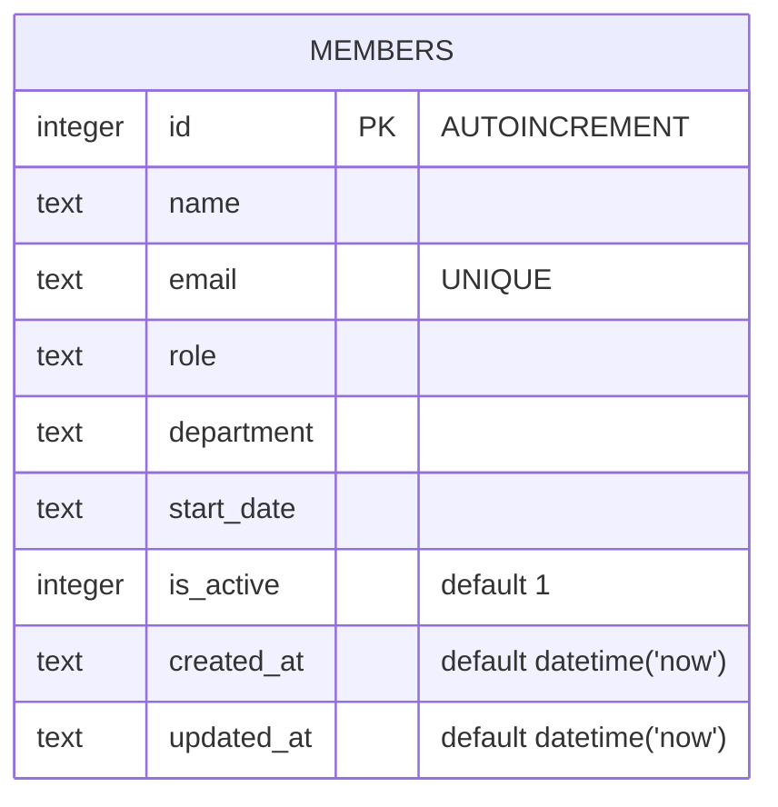

Single-table schema, defined inline in `getDb()` (no migration files exist —
this DDL runs every time the DB file/connection doesn't already have the
table).

- `email` has a `UNIQUE` constraint — both `POST /api/members`
  (`server/src/routes/members.ts:33-45`) and `PATCH /api/members/:id`
  (`server/src/routes/members.ts:93-111`) catch the resulting SQLite error by
  matching `err.message.includes('UNIQUE')` and return 409. Any other DB
  error is rethrown, so it isn't silently swallowed. See [[gotchas]] — the
  `PATCH` route didn't always have this catch.
- `department` has **no** constraint or enum at the DB or route level —
  `POST`/`PATCH` accept any string. See
  [[gotchas]] for why this is a live, intentionally-tracked gap rather than
  an oversight.
- `is_active` is an integer flag, not a boolean column type (SQLite has no
  native boolean) — `GET /api/members` filters `WHERE is_active = 1`;
  `DELETE /api/members/:id` does a hard `DELETE`, not a soft-delete flip of
  `is_active` — despite the column existing for that purpose, nothing in the
  current routes ever sets it to `0`.
