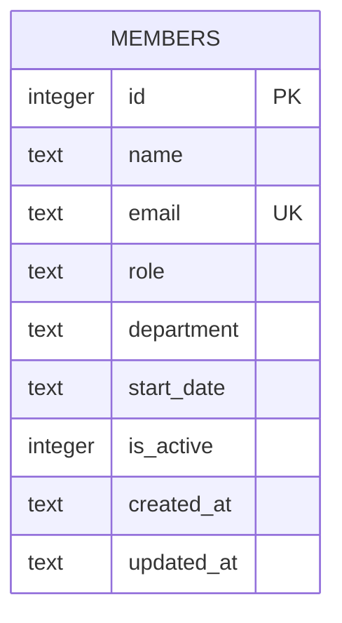

Single table, defined inline in `server/src/db.ts:18-30` (no migration files, no ORM — see [[overview]]).

- `email` has a `UNIQUE` constraint; `POST /api/members` catches the SQLite unique-violation and turns it into a `409` (`server/src/routes/members.ts:39-44`) rather than letting the raw DB error surface.
- **`is_active` is written once, at insert time (`DEFAULT 1`), and never updated afterward.** `DELETE /api/members/:id` (`server/src/routes/members.ts:106-117`) hard-deletes the row rather than setting `is_active = 0`, and `PATCH /api/members/:id` (`server/src/routes/members.ts:83-104`) doesn't touch `is_active` either. The column exists and `GET /api/members` filters on it (`WHERE is_active = 1`), but nothing in the codebase ever produces an inactive-but-present row — so that filter is currently a no-op over the live data. Anyone adding a "deactivate" or "soft delete" feature should reuse this existing column rather than adding a new one.
- `department` is a free-text `TEXT` column with no `CHECK` constraint or enum — see [[gotchas]] for why this matters for `POST` validation.
