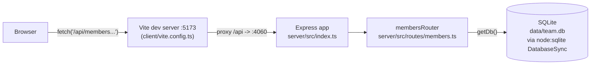

See ../../CLAUDE.md and ../../README.md for the stated layout and endpoint list — both are accurate. This page adds the wiring those docs don't spell out.

Notes on edges that aren't obvious from file names alone:
- The client never talks to the server directly by port in dev — `client/vite.config.ts` proxies `/api` to `http://localhost:4060`, so `App.tsx`'s bare `fetch('/api/members')` calls only work through the Vite dev server or once the server itself serves the built client (it currently does not — `server/src/index.ts` mounts only `membersRouter`, no static file serving).
- `getDb()` (`server/src/db.ts:11`) is a lazy singleton — the first call opens/creates the SQLite file and seeds it if empty. Every route handler calls `getDb()` per-request rather than holding a module-level reference, but they all resolve to the same singleton.
- There is no separate model/service layer — `server/src/routes/members.ts` embeds SQL directly in route handlers.
