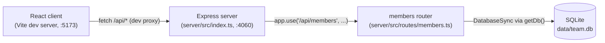

Two independently-run processes in dev (`pnpm dev` via `concurrently`): the Vite client
proxies any `/api` request to `http://localhost:4060` (`client/vite.config.ts:9`), and the
Express server owns the SQLite connection as a lazily-initialized singleton (`server/src/db.ts:9-16`)
shared across all requests in-process — there is no connection pool.
