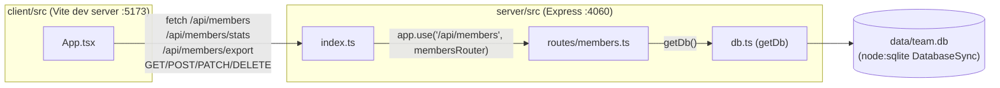

Vite's dev server proxies any `/api` request to `http://localhost:4060` (`client/vite.config.ts:9`), which is why the client's `fetch('/api/members')` calls (`client/src/App.tsx:30`) work without a full URL during `pnpm dev`. In production the client isn't served by Express at all — `pnpm build`/`pnpm start` only builds and runs the server (`package.json:13,17`); there's no static-file serving of the client bundle in `server/src/index.ts`.

`db.ts`'s `getDb()` is a lazy singleton — the module-level `db` variable is created on first call and reused, so all requests within one process share one `DatabaseSync` connection (`server/src/db.ts:9-16`).
