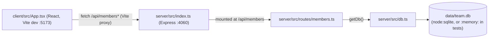

- The client never talks to the server on a different origin in dev: Vite's
  dev server proxies any `/api` path to `http://localhost:4060`
  (`client/vite.config.ts:8-10`), so `App.tsx` just calls relative paths like
  `fetch('/api/members')`.
- `server/src/index.ts` is the only Express entrypoint; it mounts
  `membersRouter` once, at `/api/members`. There is no other router or
  middleware layer beyond `cors()` and `express.json()`.
- `getDb()` is a lazy singleton (module-level `db` variable) — the first
  caller in a process pays the cost of creating the file/dir and seeding
  data; every route handler calls `getDb()` per-request rather than holding
  a reference.

See [[data-model]] for the schema and [[gotchas]] for the seed/singleton
caveats.
