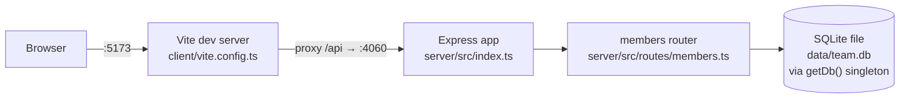

- The proxy is the *only* link between client and server in dev (`client/vite.config.ts` forwards `/api` to `http://localhost:4060`) — there's no shared package or type import between `client/` and `server/`; the `Member`/`Stats` interfaces in `client/src/App.tsx` are hand-duplicated from `MemberRow` in `server/src/routes/members.ts` and can drift silently (no shared types package).
- `getDb()` (`server/src/db.ts:11`) is a module-level singleton: the first caller opens the `DatabaseSync` connection and runs the `CREATE TABLE IF NOT EXISTS` + seed insert; every later call returns the same handle. There is one process-wide connection, not one per request.
- `pnpm dev` runs two independent processes (`concurrently`): `dev:server` watches `dist/server/index.js` (requires `pnpm build` to have run at least once, since it doesn't run `tsc --watch`), `dev:client` runs Vite directly. Editing `server/src/*.ts` alone during `pnpm dev` won't pick up changes until the compiled `dist/` output is rebuilt.
