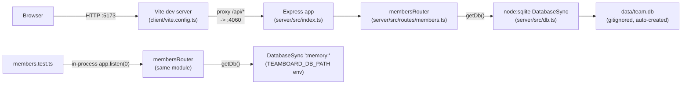

## Non-obvious edges

- The client never talks to the server directly in dev — everything goes through
  Vite's `/api` proxy (`client/vite.config.ts:8-10`), which hardcodes
  `http://localhost:4060`. There's no env var for this; changing the server port
  requires editing `client/vite.config.ts` and `server/src/index.ts` together.
- `getDb()` is a lazy singleton (`server/src/db.ts:9,12`) — the DB connection and
  schema/seed creation only happen on the first route handler that calls it, not at
  server startup. Tests exploit this: they set `process.env.TEAMBOARD_DB_PATH` before
  importing/calling the router so the first `getDb()` call binds to `:memory:` instead
  of `data/team.db` (`server/src/routes/members.test.ts:24`).
- The seed data (8 members) is inserted only when the table is empty
  (`server/src/db.ts:32-45`), so it never re-runs against an existing `data/team.db`.
