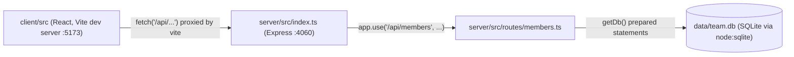

Two independent processes in dev (`pnpm dev` runs both via `concurrently`): the Express server (compiled from `server/src/`, run with `node --watch`) and the Vite dev server (serving `client/src/` directly, no build step). They only talk over HTTP through the `/api` proxy — there's no shared in-process import between `client/` and `server/`, and the two `tsconfig.json` files (`client/tsconfig.json`, `server/tsconfig.json`) are configured independently. In production (`pnpm start`), only the compiled server runs — nothing serves the built client, so `pnpm build` only compiles `server/src` (see `package.json`'s `build` script targeting `server/tsconfig.build.json`).
