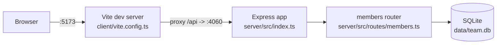

Layout and endpoints are already documented in `../../CLAUDE.md` and `../../README.md` — see those for the file map and the API table.

Non-obvious edges:
- The client never talks to port 4060 directly — it always calls relative `/api/...` paths (`client/src/App.tsx`), and only the Vite dev proxy (`client/vite.config.ts`) routes those to the Express server. There's no `VITE_API_URL`-style env override.
- There is a single Express app with one mounted router (`/api/members`); no other services or processes are involved.
- `getDb()` in `server/src/db.ts` is a lazy singleton — the DB file/connection is created on first request, not at server startup.
