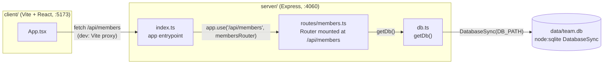

- The client never talks to SQLite directly — all access goes through the
  Express router in `server/src/routes/members.ts`.
- `getDb()` (`server/src/db.ts:11`) is a lazy singleton: the first call opens
  (and seeds) the DB file, every later call reuses the same `DatabaseSync`
  handle. There is no connection pool — this is a single-process, single-file
  SQLite setup, not meant to run multiple server instances against one file.
- In dev, the client (`:5173`) and server (`:4060`) are separate processes
  wired together only by the Vite proxy config; in a built/production deploy
  there is no static-file serving of the client from the Express app — `pnpm
  build`/`pnpm start` only run the server.

See [[data-model]] for the schema behind `Db`.
