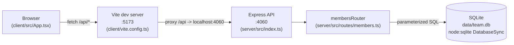

Two independent processes in dev (`pnpm dev` runs both via `concurrently`): Vite only proxies `/api` requests to the Express server, it does not import server code. The Express app mounts the entire members feature — CRUD, `/export`, `/stats` — as one router at `/api/members` (server/src/index.ts:11); there's no other router or service. `getDb()` in server/src/db.ts is a lazy singleton opened on first call, shared by every request in the process — there's no connection pool since `node:sqlite` is synchronous, in-process.
