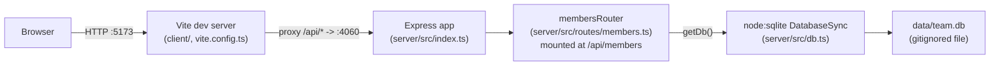

Notes on edges that aren't obvious from the file list alone:
- The client never talks to the server directly by port in dev — `client/vite.config.ts` proxies `/api` to `http://localhost:4060`, so `App.tsx` just calls relative paths like `fetch('/api/members')`.
- `getDb()` in `server/src/db.ts` is a lazy module-level singleton (`let db: DatabaseSync`) — the connection is opened on first call, not at import time. This matters for tests (see [[testing]]).
- There is only one router (`membersRouter`) and it owns everything under `/api/members`, including the non-CRUD `/export` and `/stats` sub-routes — those are defined *before* the `/:id` route in `members.ts` so Express doesn't try to parse "export"/"stats" as an id.
