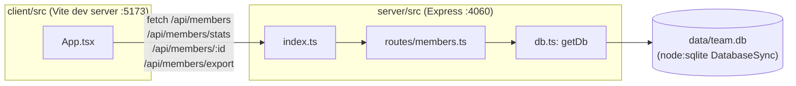

- The client never talks to SQLite directly — all reads/writes go through the
  five `router.*` handlers in `server/src/routes/members.ts`, which each call
  `getDb()` per-request.
- `getDb()` is a lazy singleton (`server/src/db.ts:11`): the first call opens the
  file (or `:memory:` if `TEAMBOARD_DB_PATH` is set — see [[testing]]), creates the
  table if missing, and seeds 8 rows if the table is empty. Every later call in the
  same process reuses that same `DatabaseSync` handle.
- There's no separate service/repository layer — route handlers issue SQL directly
  against `getDb()`. See [[backend]] for the convention this implies.
- The Vite dev server proxies `/api/*` to the Express server; there's no shared
  runtime process between `dev:server` and `dev:client` (`package.json` scripts),
  they're started together only via `concurrently`.
