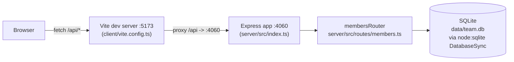

Layout and commands are covered in ../../CLAUDE.md and ../../README.md — see those for the file tree and script list.

Non-obvious edges:
- The client never talks to the server directly in dev — Vite's `server.proxy` (client/vite.config.ts:8-10) forwards `/api` to `http://localhost:4060`, so the server must be running on port 4060 for `pnpm dev:client` to work standalone.
- `getDb()` (server/src/db.ts) is a lazy singleton: the file/table is created and seeded on first call, not at process start. Tests override this via `TEAMBOARD_DB_PATH=':memory:'`, set as an env var before importing the router.
- There is no separate build step wiring client and server together — in production `pnpm build` only compiles the server (`tsc -p server/tsconfig.build.json`); the client is served by Vite in dev and isn't part of `pnpm start`.
