```mermaid
flowchart LR
  Browser["Browser\n(client/src/App.tsx)"]
  Vite["Vite dev server :5173\n(client/vite.config.ts)"]
  Express["Express app :4060\n(server/src/index.ts)"]
  Router["membersRouter\n(server/src/routes/members.ts)"]
  DB["DatabaseSync singleton\n(server/src/db.ts)"]
  File["data/team.db\n(or :memory: in tests)"]

  Browser -- "fetch('/api/members*')" --> Vite
  Vite -- "proxy /api -> localhost:4060" --> Express
  Express -- "app.use('/api/members', membersRouter)" --> Router
  Router -- "getDb()" --> DB
  DB --> File
```

Two things this diagram makes explicit that aren't spelled out elsewhere:

- The client never talks to Express directly in dev — Vite's `server.proxy` (`client/vite.config.ts:8-10`) forwards `/api/*` to `http://localhost:4060`. If the server isn't running on 4060, the client's `fetch` calls in `App.tsx` fail even though Vite itself is up.
- `getDb()` is a module-level singleton (`let db: DatabaseSync`, `server/src/db.ts:9-16`) — every request handler in `members.ts` calls `getDb()` but they all share the one connection created on first call. See [[gotchas]] for why that matters for tests and `TEAMBOARD_DB_PATH`.
