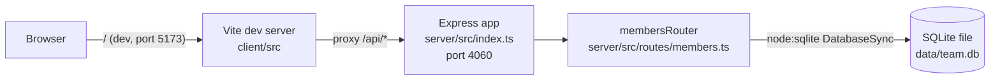

- The client never talks to the server directly in dev — Vite's `server.proxy` (client/vite.config.ts:8-10) forwards `/api` to `http://localhost:4060`. In production (`pnpm start`), Express serves only the API; there's no static-file serving of the built client in server/src/index.ts.
- `getDb()` (server/src/db.ts:11) is a lazy singleton — the DB connection and schema/seed creation happen on first call, not at server startup.
- There is only one API module (`membersRouter`); it's mounted at `/api/members` in server/src/index.ts:11.
