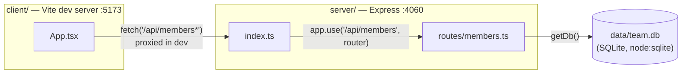

- The `/api` proxy (`client/vite.config.ts:9`) only exists in the Vite dev server. `server/src/index.ts` registers only the members router — there's no `express.static` call, so nothing serves the client's built assets in production. `pnpm build` (`package.json:13`) compiles the server only; the client build isn't wired into `build`/`start` at all.
- `getDb()` (`server/src/db.ts:11`) is a lazy module-level singleton shared by every route handler in a process — there's one `DatabaseSync` connection for the life of the server, not one per request.
