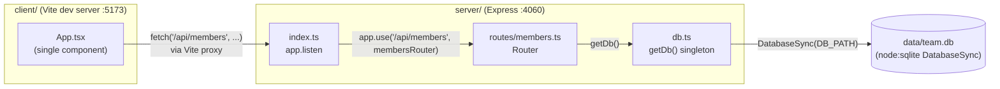

- The client never talks to the server directly in dev — `client/vite.config.ts:8` proxies `/api` to `http://localhost:4060`. In production there's no reverse proxy configured anywhere in the repo; `pnpm build` only compiles the server (`package.json:13`), so serving the built client is not wired up.
- `getDb()` (`server/src/db.ts:11`) is a module-level singleton: the first caller's `DB_PATH` (from `TEAMBOARD_DB_PATH`, defaulting to `data/team.db`) wins for the process lifetime. There is one Express app, one router, one DB connection — no connection pooling, no per-request DB handles.
- No message queue, no external services, no auth layer — `cors()` and `express.json()` (`server/src/index.ts:8-9`) are the only middleware.
