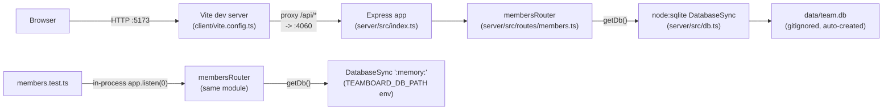

## Non-obvious edges

- The client's dev proxy target is no longer hardcoded: `client/vite.config.ts:7-8` reads
  `TEAMBOARD_HOST`/`TEAMBOARD_PORT` (falling back to legacy `PORT`), mirroring the same
  defaults as `server/src/config.ts`. Overriding those env vars changes both the server's
  listen address and the client's proxy target together — there's no more editing
  `vite.config.ts` and `index.ts` in lockstep to move the port.
- `getDb()` is a lazy singleton (`server/src/db.ts:9,13`) — the DB connection and
  schema/seed creation only happen on the first route handler that calls it, not at
  server startup. Tests exploit this: they set `process.env.TEAMBOARD_DB_PATH` before
  importing/calling the router so the first `getDb()` call binds to `:memory:` instead
  of `data/team.db` (`server/src/routes/members.test.ts:24`).
- The seed data (8 members) is inserted only when the table is empty
  (`server/src/db.ts:30-42`), so it never re-runs against an existing `data/team.db`.
