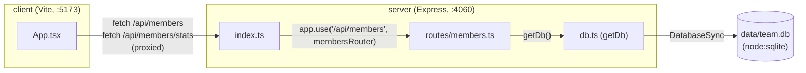

- The client never talks to the server on its own port directly in dev — Vite's dev-server proxy (`client/vite.config.ts`) forwards any `/api` request from `:5173` to `:4060`. There's no build-time env var for the API base URL; if the proxy config changes, `App.tsx`'s bare `fetch('/api/...')` calls break.
- `db.ts`'s `getDb()` is a lazy singleton (`let db: DatabaseSync`) — the whole process shares one connection, created on the first call. This is why tests must set `TEAMBOARD_DB_PATH` before any handler runs (see [[testing]]).
- There is no service boundary beyond client/server — `routes/members.ts` is the only router, mounted once at `/api/members` in `index.ts`.
