```mermaid
flowchart LR
  Browser["Browser (client/src/App.tsx)"]
  Vite["Vite dev server :5173\n(client/vite.config.ts)"]
  Express["Express app :4060\n(server/src/index.ts)"]
  Router["membersRouter\n(server/src/routes/members.ts)"]
  DB["SQLite file data/team.db\n(server/src/db.ts getDb())"]

  Browser -->|"fetch /api/members, /api/members/stats, /api/members/:id, /api/members/export"| Vite
  Vite -->|"proxy /api/* -> http://localhost:4060"| Express
  Express -->|"app.use('/api/members', membersRouter)"| Router
  Router -->|"db.prepare(...).run/get/all"| DB
```

There is no build-time coupling between `client/` and `server/` — they only talk over HTTP through the Vite dev proxy (`client/vite.config.ts:9`). In production (`pnpm start`), the compiled server serves only the API; there's no static-file serving of the client bundle wired into `server/src/index.ts`, so a real deployment needs a separate step to serve `client`'s built assets (not present in this repo today).
