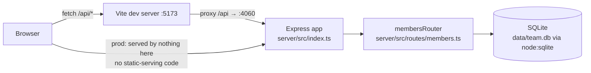

- The client never talks to the server directly in dev — Vite's `server.proxy`
  (`client/vite.config.ts`) forwards `/api` to `http://localhost:4060`. There is
  no reverse proxy or gateway beyond that.
- `pnpm start` runs only `dist/server/index.js` — there is no code path in this
  repo that serves the built client from Express (no `express.static`, no SPA
  fallback route). Production serving of `client`'s build output is not wired
  up anywhere in the source.
- `getDb()` (`server/src/db.ts`) is a lazy singleton: the first call opens (and
  seeds, if empty) `data/team.db`, or an in-memory DB when
  `TEAMBOARD_DB_PATH=:memory:` (used by tests). All requests share this one
  `DatabaseSync` handle — there is no connection pool.
