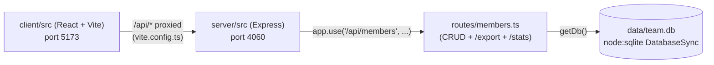

Two independently-run processes (`pnpm dev:client`, `pnpm dev:server`,
launched together by `pnpm dev` via `concurrently`) — there is no shared
in-process import between `client/` and `server/`. The only integration point
is the HTTP proxy Vite sets up for `/api` (client/vite.config.ts:8-10) to the
Express server on port 4060 (server/src/index.ts:6). `getDb()`
(server/src/db.ts:11) lazily opens a single module-level `DatabaseSync`
handle shared by every route in members.ts.
