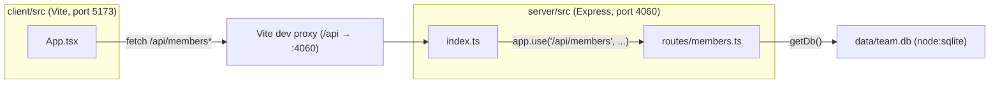

- The client never talks to the server directly in dev — `client/vite.config.ts` proxies every `/api/*` request to `http://localhost:4060`, so `App.tsx` can call bare paths like `fetch('/api/members')`.
- `getDb()` in `server/src/db.ts` is a lazy singleton: the first call creates/opens `data/team.db`, runs `CREATE TABLE IF NOT EXISTS`, and seeds 8 rows if the table is empty. Every route handler calls `getDb()` per-request but reuses the same connection.
- There is no separate build/serve step for production — `pnpm start` runs the compiled Express server only; static client hosting isn't wired up in this repo (no `express.static` call in `server/src/index.ts`).
