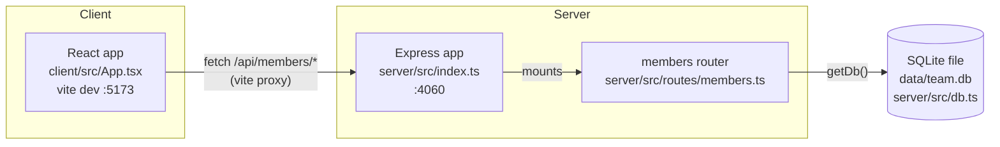

- The client never talks to the server's port directly in dev — Vite proxies
  any `/api` request to `http://localhost:4060` (`client/vite.config.ts:9`).
  In production there is no proxy config; the client build must be served
  behind something that forwards `/api` to the Express process.
- `server/src/index.ts` mounts the entire members router at `/api/members`
  (`app.use('/api/members', membersRouter)`), so every path in
  `members.ts` is relative to that prefix.
- There is exactly one router (`members`) and one table (`members`) — no
  other domain modules exist yet.
