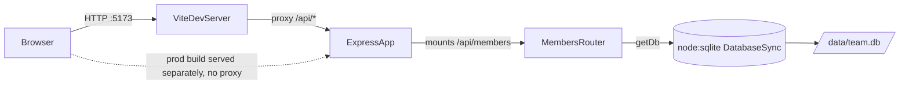

- The Vite dev server (`client/vite.config.ts:8`) only proxies `/api` to
  `http://localhost:4060` in dev. There's no reverse proxy config for a
  production deployment in this repo — `pnpm build` only compiles the server
  (`package.json:13`); the client isn't part of that build script.
- `MembersRouter` is the only router mounted (`server/src/index.ts:11`) — all
  API surface lives in `server/src/routes/members.ts`.
- `getDb()` (`server/src/db.ts:11`) lazily opens a single module-level
  `DatabaseSync` connection and seeds it on first call. `TEAMBOARD_DB_PATH=:memory:`
  swaps the file for an in-memory DB — this is how tests isolate themselves
  (see `[[testing]]`).
