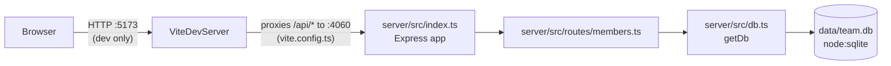

Layout and endpoint list are correct as documented in `../../CLAUDE.md` and `../../README.md` — see those first.

## Gap: no production static-serving path

`server/src/index.ts` only mounts `/api/members` — it never serves `client/`'s built assets. `package.json`'s `build` script (`tsc -p server/tsconfig.build.json`) compiles the server only; there is no `build:client` script and no `express.static(...)` call anywhere in `server/src/`. The `/api` proxy in `client/vite.config.ts` only exists in the Vite dev server, so `pnpm start` (running the compiled server alone) has no route that serves the React app. Any change intended to ship a production client build needs to add both a client build step and static-file serving — neither exists today.

## DB singleton lifetime

`getDb()` (`server/src/db.ts:11`) memoizes a single module-level `db` connection and reads `TEAMBOARD_DB_PATH` only on module load of the first call. Tests rely on this: `server/src/routes/members.test.ts` sets `process.env.TEAMBOARD_DB_PATH = ':memory:'` before importing the router so the first `getDb()` call binds to the in-memory DB. Setting that env var after any handler has already run is a no-op.
