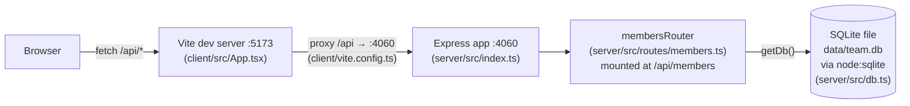

Two independent Node processes in dev, started together by `pnpm dev` (`concurrently`, see `package.json`): `dev:server` runs the compiled server (`node --watch dist/server/index.js`) and `dev:client` runs Vite. There is no build-time bundling between them — the client only ever talks to the server over HTTP through the `/api` proxy; there are no direct imports between `client/` and `server/`.

`getDb()` (`server/src/db.ts:11`) is a lazy module-level singleton — one `DatabaseSync` connection per server process, created on first request and reused for the process lifetime. There's no connection pool or teardown path in production; tests override the DB path to `:memory:` to get isolation instead (see `../conventions/testing.md`).
