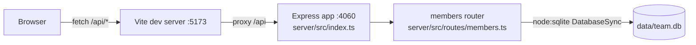

- The client never talks to the server directly in dev — Vite's `server.proxy` (`client/vite.config.ts:7-11`) forwards `/api` to `http://localhost:4060`. In production there's no built-in reverse proxy; `pnpm start` only serves the compiled API (`server/src/index.ts`), so serving the built client is out of scope of this repo as it stands.
- `server/src/index.ts` mounts a single router (`membersRouter`) at `/api/members` — there is only one route module in the whole server.
- `getDb()` (`server/src/db.ts:11-48`) lazily opens one process-wide `DatabaseSync` handle and seeds it on first call if the `members` table is empty; there's no connection pool or separate migration step.
