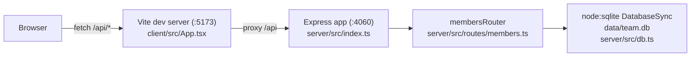

- Single-page React app with no client-side router or state library — all
  state lives in `App.tsx`'s `useState`/`useEffect` hooks.
- `membersRouter` is mounted once, at `/api/members` (`server/src/index.ts:11`);
  there is no other router or module in the server.
- `getDb()` (`server/src/db.ts`) is a lazy singleton — the first caller in the
  process creates the file (or `:memory:` DB) and seeds it; every route
  handler shares that one connection.
