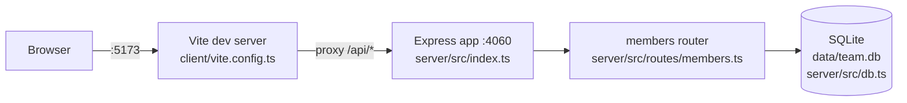

`getDb()` in server/src/db.ts is a module-level singleton: the first caller to
invoke it opens the file (or `:memory:`) and runs the `CREATE TABLE IF NOT
EXISTS` + seed insert; every later call reuses that same connection. The
`TEAMBOARD_DB_PATH` env var must be set before that first call — tests rely on
this by setting it at module load time in members.test.ts, before the router
(and its lazy `getDb()` calls) ever runs.

## Gap: no production static-file serving

`pnpm build` (package.json) only compiles `server/tsconfig.build.json` — there
is no equivalent client build step wired into `pnpm build`, and server/src/index.ts
never calls `express.static(...)` to serve a client bundle. The Vite proxy in
client/vite.config.ts only wires `/api` in dev mode. There is currently no path
in this repo that serves the built client in production; `pnpm dev` (client +
server side by side) is the only working end-to-end flow.
