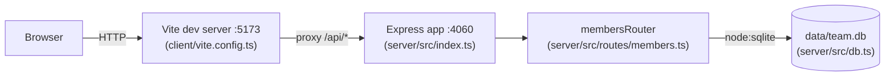

- The client never talks to the server directly in dev — `vite.config.ts`
  proxies any `/api` request from `:5173` to `http://localhost:4060`, so
  `client/src/App.tsx` calls relative paths like `fetch('/api/members')`.
- `membersRouter` is mounted once, at `/api/members`, in `server/src/index.ts`;
  all member CRUD, `/export`, and `/stats` are sub-routes of that single
  router file.
- `getDb()` (`server/src/db.ts`) is a lazy module-level singleton — the first
  caller (whichever route handler runs first) creates the file at
  `data/team.db` and seeds it if empty. There is no connection pool; every
  request reuses the same `DatabaseSync` handle.
